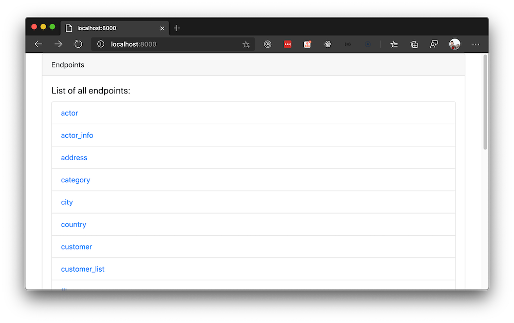
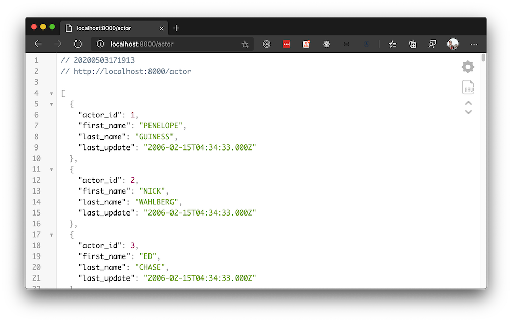

A simple application to generate endpoints for a given database.

## Getting Started

- Clone the project and install its dependencies

```js
git clone https://github.com/SirwanAfifi/node-crud
yarn
```

- Create a `.env` file then add your database credentails (use `.env.example` for the keys)

- Run the project `yarn start`:




## To Do

- [ ] Add POST endpoint for inserting records
- [ ] Add filtering support
